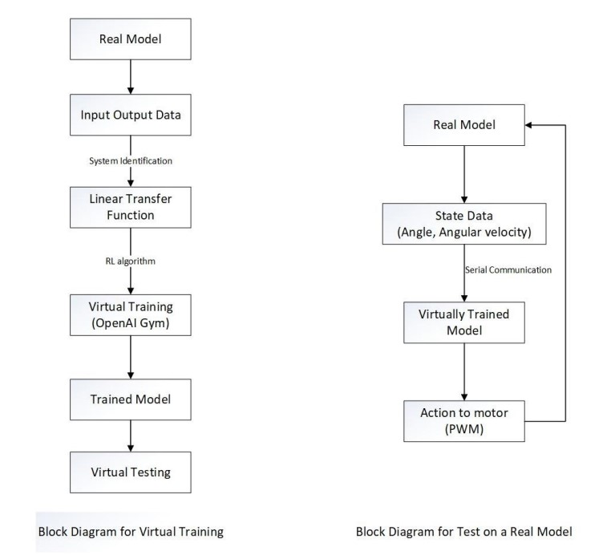
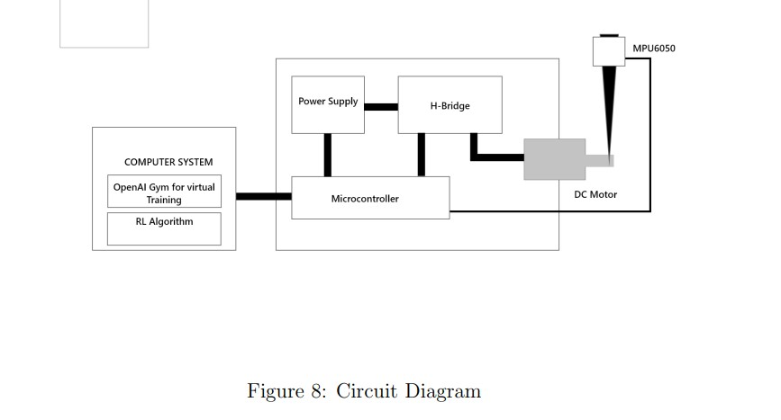
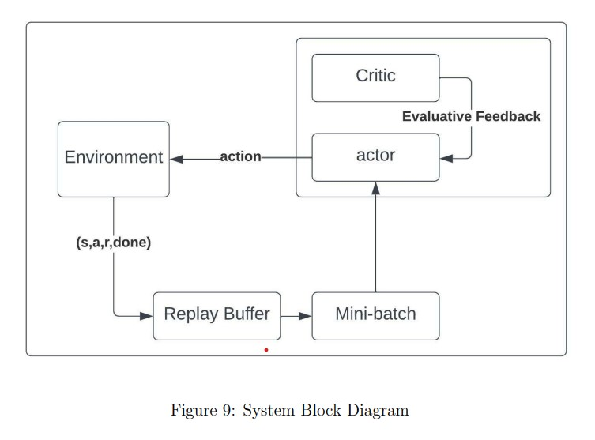
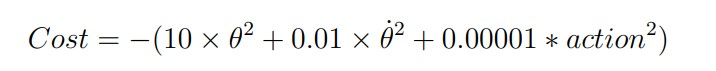
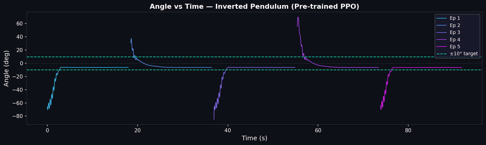
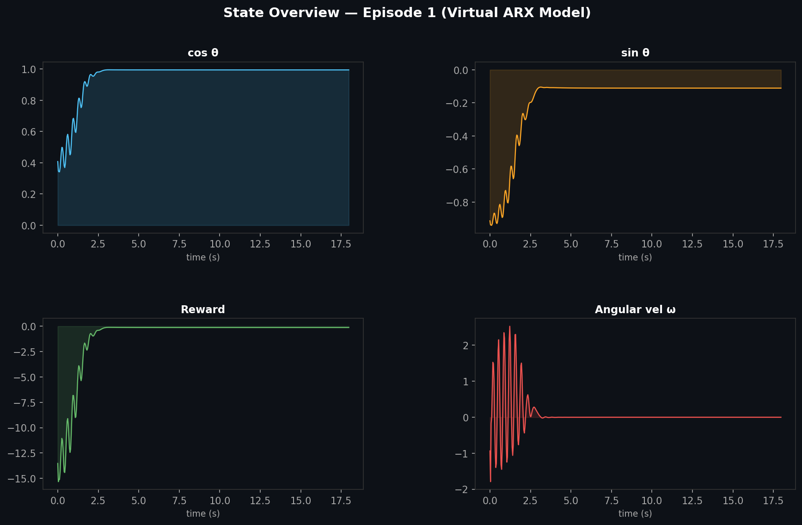
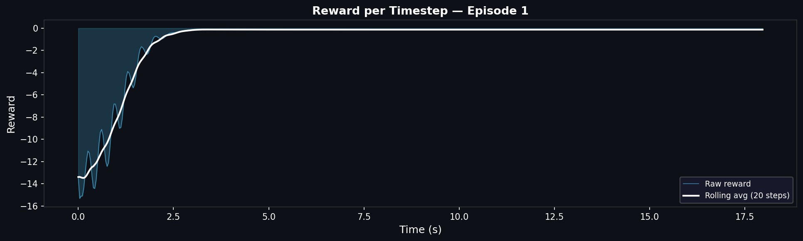

# Inverted Pendulum Control using Reinforcement Learning (PPO)

> Balancing a real inverted pendulum using a PPO Actor-Critic agent trained entirely in a custom simulation built from hardware system identification data, then deployed zero-shot to physical hardware.

---

## Overview

Traditional control methods (PID, LQR) require precise mathematical models and must be retuned when system parameters change. This project replaces that with a **Proximal Policy Optimization (PPO)** agent that learns to balance the pendulum through trial and error — and generalises to the real hardware without any fine-tuning.

The key insight: instead of using a generic physics simulator, we **identified the real system's dynamics** using MATLAB's System Identification Toolbox (ARX model, 98.75% fit) and built a custom OpenAI Gym environment from that model. The agent never sees the real hardware during training.

---

## Pipeline

**Block Diagrams:**

<p align="center">
  
</p>

---

## Hardware

<p align="center">
  
</p>

| Component | Role |
|---|---|
| MPU6050 (IMU) | Measures pendulum angle θ and angular velocity θ̇ |
| ATmega328P (Arduino) | Reads sensor, receives PWM commands via serial |
| H-Bridge Motor Driver | Amplifies PWM signal to drive DC motor |
| DC Motor | Applies corrective torque to the pendulum rod |
| Computer (Python) | Runs pre-trained actor network, sends actions via serial |

**Communication:** Python ↔ Arduino over PySerial at 2,000,000 baud. Angle limit for episode termination: ±70°.

---

## System Identification

The pendulum dynamics were captured experimentally:

1. Applied a **PRBS (Pseudorandom Binary Sequence)** input to excite the system across frequencies
2. Recorded input/output data at **36ms sampling intervals**
3. Fed data into MATLAB's **System Identification Toolbox** → fitted a Polynomial ARX model
4. Selected best-fit order (na=2, nb=9, nk=1) — **98.75% fit to estimation data**

The resulting discrete-time ARX model:

```
A(z)y(t) = B(z)u(t) + e(t)
A(z) = 1 - 1.611 z⁻¹ + 0.5599 z⁻²
B(z) = -0.001949 z⁻¹ + 0.002877 z⁻² + 0.008892 z⁻³ + 0.01766 z⁻⁴
       + 0.002082 z⁻⁵ + 0.002943 z⁻⁶ - 0.001987 z⁻⁷ - 0.0008178 z⁻⁸ + 0.0001022 z⁻⁹
```

This equation is implemented directly in `pendulum.py` as the custom Gym environment step function.

---

## Algorithm — PPO with Actor-Critic

<p align="center">
  
</p>

The agent uses **Proximal Policy Optimization (PPO)** with an Actor-Critic architecture:

- **Actor** — outputs a continuous action (PWM value) given the current state [cos θ, sin θ, θ̇]
- **Critic** — estimates the state-value function V(s) to compute advantages
- **PPO clip** — constrains policy updates to prevent destructive large steps (ε = 0.2)

**Actor network:**
```
Input (3,) → Dense(128, ReLU) → Dense(64, ReLU) → Dense(64, ReLU) → Dense(1, tanh) × upper_bound
```

**Critic network:**
```
Input (3,) → Dense(64, ReLU) → Dense(64, ReLU) → Dense(64, ReLU) → Dense(1)
```

---

## Reward / Cost Function

<p align="center">
  
</p>

The reward penalises angle deviation, angular velocity, and excessive control effort:

```
reward = −(10·θ² + 0.01·θ̇² + 0.00001·action²)
```

The heavy weight on θ² (×10) prioritises keeping the pendulum upright. The tiny weight on action² (×0.00001) discourages unnecessary motor activity without over-constraining the controller.

---

## Training Hyperparameters

| Hyperparameter | Value |
|---|---|
| Max seasons | 50 |
| Episodes per season | 50 |
| Test episodes | 1 |
| Training epochs per season | 20 |
| Discount factor γ | 0.9 |
| Actor learning rate | 0.0001 |
| Critic learning rate | 0.0002 |
| Batch size | 50 |
| Max buffer size | 20,000 |
| PPO clip ε | 0.2 |
| λ (advantage) | 0.5 |
| KL target | 0.01 |

---

## Results

### Virtual Model

The angle settles within **±10°** of vertical and holds there. The spike at the start of each episode represents the random initial condition reset.

<p align="center">
  
</p>

<p align="center">
  
</p>

<p align="center">
  
</p>

The angular velocity plot shows damped oscillation — the controller applies progressively smaller corrections until the pendulum is stable.

### Real Hardware

The pre-trained model was deployed directly to the physical system without any retraining. The angle again settles within **±10°**. Performance is slightly worse than the virtual model, but the policy generalises well to the real hardware.

---

## Project Structure

```
inverted_pendulum_RL/
├── pendulum.py               # Custom ARX-based Gym environment
├── inv_pendulum(1).py        # PPO agent + training loop (virtual)
├── ppo1.py                   # PPO agent + hardware deployment loop
├── run_demo.py               # Load weights + generate plots (no hardware needed)
├── actor_weights (1).h5      # Pre-trained actor weights
├── critic_weights (1).h5     # Pre-trained critic weights
├── result_clip_1.txt         # Training log
└── pictures/
    ├── angle_vs_time.png
    ├── reward_per_step.png
    ├── state_overview.png
    ├── flowchart.jpg
    ├── actor_critic.jpg
    ├── block_circuit.jpg
    └── cost_function.jpg
```

---

## Running the Demo (No Hardware Required)

```bash
# 1. Install dependencies
pip install tensorflow==2.18.0 tensorflow-probability==0.24.0 gymnasium matplotlib scipy

# 2. Run virtual demo with pre-trained weights
python run_demo.py
```

This runs 5 episodes on the virtual ARX environment and saves three plots:
`angle_vs_time.png`, `reward_per_step.png`, `state_overview.png`

---

## Built With

- Python 3 · TensorFlow 2 · OpenAI Gym
- MATLAB System Identification Toolbox
- Arduino (ATmega328P) · MPU6050 · PySerial

---

*Project completed 2021–2022.*
